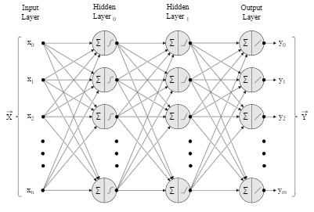
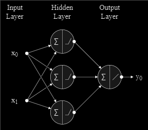
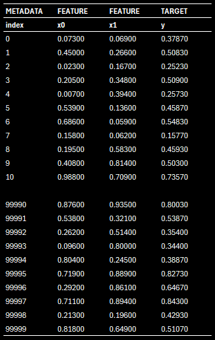
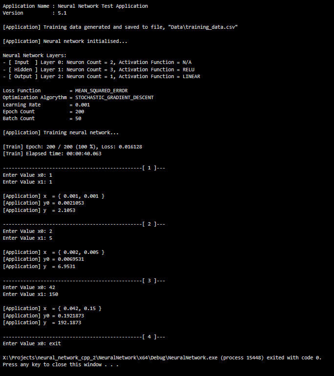

# General Purpose Multi-layer Perceptron Network Class
- General-purpose neural network class.
- Can be used for both regression and classification problems.

  

## Table of Contents
1. [Installation](#installation)
2. [Overview](#overview)
3. [Example Use Case](#example-use-case)
4. [Contributing](#contributing)
5. [License](#license)
6. [Contact Information](#contact-information)
7. [Acknowledgements](#acknowledgements)
8. [To-Do](#to-do)
9. [Version History](#version-history)

## Installation:
...To do.

## Overview:
### Regression Problems :
- **Hidden Layers:**
  - The most common activation function for hidden layers in regression problems is the Rectified Linear 
    Unit ( ReLU ). 
  - ReLU allows gradients to flow back efficiently during training ( avoiding vanishing gradients ) and can 
    model non-linear relationships well.
  - Other options include Leaky ReLU, which addresses the "dying ReLU" problem, or even parametric ReLU ( PReLU ) 
    for added flexibility.
    
- **Output Layer:**
  - In regression, the output layer typically uses a linear activation function.
  - This ensures the final output represents a continuous value on the real number line, which aligns with the 
      desired outcome in regression tasks ( e.g., predicting house prices or stock values ).

### Classification Problems :
- **Hidden Layers:**
  - Similar to regression, ReLU is a popular choice for hidden layers in classification problems due to its 
    efficiency in training.
  - However, other options like tanh ( squashes values between - 1 and 1 ) or sigmoid ( outputs between 0 and 1 )
    can also be used.
  - These functions can be helpful if your data naturally falls
    within a specific range.
    
- **Output Layer:**
  - The choice for the output layer depends on the number of classes you're predicting.
  - **Binary Classification ( Two Classes ):**
    - Use the sigmoid function to transform the final output into a probability between 0 ( class 1 ) 
      and 1 ( class 2 ).
  - **Multi-Class Classification ( More Than Two Classes ):**
    - Here, you typically employ the softmax function.
    - Softmax normalizes the output layer's activations into probabilities that sum to 1, representing the
      probability of each class.      

**Note:**
- The "optimal" activation function can vary depending on your specific dataset and problem.
- Experimentation is often key. It's a good practice to start with the recommended choices above and then compare
  different options using techniques like grid search or random search to find the best-performing combination
  for your situation.

## Example Use Case

- Goal:  
  A neural network trained to add two integers.  
  $y = f ( x_0, x_1 ) \hspace{0.5cm} ...Where \hspace{2mm} f ( x_0, x_1 ) = x_0 + x_1, \hspace{4mm} x_0 \in \mathbb{Z}, \hspace{4mm} x_1 \in \mathbb{Z}$

- Initialisation Code:

    

  ```C++
  // Initialise neural network.

  vector <int>                layers                 = { 2, 3, 1 };
  vector <ActivationFunction> activation_functions   = { RELU, LINEAR };
  LossFunction                loss_function          = MEAN_SQUARED_ERROR;
  double                      learning_rate          = 0.001;
  int                         epoch_count            = 200;
  int                         batch_size             = 50;
  OptimizationAlgorithm       optimization_algorithm = STOCHASTIC_GRADIENT_DESCENT;
  
  NeuralNetwork neural_network
  (
      layers,
      activation_functions,
      loss_function,
      learning_rate,
      epoch_count,
      batch_size,
      optimization_algorithm,
      training_results_file_name
  );
  ```

- Test Data:

  
  
- Test Run:
  
  
  

## Contributing
Contributions are welcome! Please follow the contribution guidelines.
1. Fork the project.
2. Create your feature branch (git checkout -b feature/AmazingFeature).
3. Commit your changes (git commit -m 'Add some AmazingFeature').
4. Push to the branch (git push origin feature/AmazingFeature).
5. Open a pull request.

## License
Distributed under the MIT License. See LICENSE for more information.

## Contact Information
- Twitter: [@rohingosling](https://x.com/rohingosling)
- Project Link: [https://github.com/your-username/your-repo](https://github.com/rohingosling/pinger)

## To-Do:
1. Re-add support for different types of weight initialization.
 
   - Xavier/Glorot Initialization:
     This method works well with activation functions like tanh and sigmoid.
      
   - He Initialization:
     This method works well with activation functions like ReLU.
 
2. Add a log file. 

## Version History:
*Ordered by year.*

| Version: 1.0 | Year: 1987 | Language: BASIC |
| :--- | :--- | :--- |

First attempt at building an ANN, on a Commodore VIC20. A variation of the Monte Carlo (MC) method was used to train the weights.<be>

**Note:**
- I did not know how to implement Backpropagation at the time, hence the use of MC.
- It later turned out, by accident really, that MC offered faster convergence, when I later learned how to implement Backpropagation and compared it with MC.

This initial VIC20 version of the ANN was able to support up to 256 weights (parameters). While not very practical, it was enough to test the ANN on a learning task to learn how to compute binary mathematical operators on 16-bit numbers.

Because the VIC20 had less than 5k of usable RAM, the training data was generated in real-time row-by-row, eliminating the need for a file of training data. The training data was structured as follows.

**Features:**
- x0 : 16-bit number. Operator operand A.
- x1 : 16-bit number. Operator operand B.
- x2 : 16-bit number. Operator, (+,-,*,/).
  - +(A,B) = 0.000
  - -(A,B) = 0.333
  - *(A,B) = 0.666
  - /(A,B) = 1.000

**Target/s:**
- y : 16-bit number. Normalized result of, *y = Operator (A,B)*.

**Example:**
```
x0     x1     x2     y      Comment
0.001  0.001  0.000  0.002  Addition:        1 + 1 = 2
0.005  0.015  0.000  0.020  Addition:       5 + 15 = 20
0.100  0.010  0.333  0.090  Subtraction:  100 - 10 = 90
0.009  0.001  0.333  0.008  Subtraction:     9 - 1 = 8
0.002  0.002  0.666  0.004  Multiplication:  2 * 2 = 4
0.012  0.003  0.666  0.036  Multiplication: 12 * 3 = 36
0.009  0.003  0.666  0.003  Multiplication:  9 / 3 = 3
0.010  0.002  0.666  0.005  Multiplication: 10 / 2 = 5
```

<br>

| Version: 1.1 | Year: 1988 | Language: 6502 Machine Language |
| :--- | :--- | :--- |

Version 1.1 was a 6502 machine language version of version 1.0. Mostly the same, but offering faster convergence, and could support up to 1024 weights (parameters). 

<br>

| Version: 2.0 | Year: 1992 | Language: C (Borland Turbo C) |
| :--- | :--- | :--- |

Complete rewrite in C, targeting an 8086 XT with 1MB RAM. This version could support up to 128,000 weights (parameters), and was successfully used to both predict stock market prices and classify technical features of stock market price data.

The market prediction model I employed at the time, used a classification model built with version 2.0, to enrich historical price data features with additional technical features, that fed into a regression model also created with version 2.0, to improve prediction accuracy.

<br>

| Version: 1.2 | Year: 1993 | Language: 6502 Machine Language |
| :--- | :--- | :--- |

Fun "retro-computing" project, to upgrade my original Commodore VIC20 code to support a Commodore 64, after being donated a Commodore 64 from my girlfriend at the time.

This version supported up to 16,000 weights. I tested it with simulated stock market data. The results showed that theoretically, an ANN implemented on a Commodore 64 could, in theory, be used for practical stock market prediction and classification tasks in the 1980s, had it been built in the 1980s.

<br>

| Version: 1.3 | Year: 1993 | Language: 6502 Machine Language |
| :--- | :--- | :--- |

Another fun "retro-computing" project to upgrade the Commodore 64 version to use Backpropagation. After getting this to work, I discovered that the Monte Carlo (MC) method I had employed in the original version was actually faster, and better at finding solutions closer to a global optima.                                 

<br>

| Version: 2.1 | Year: 1993 | Language: C, 80x86 Assembly Language |
| :--- | :--- | :--- |

Upgrade to 2.0, which replaced slow C functions with inline 80x86 Assembler versions of those functions. Everything else was the same as version 2.0, but with faster convergence.

<be>

| Version: 2.2 | Year: 1993 | Language: C, 80x86 Assembly Language |
| :--- | :--- | :--- |

Added support for additional activation functions, loss functions, and optimization functions.

Supported Activation Functions:
- Linear
- Sigmoid
- TanH

Supported LossFunctions:
- MSE (Mean Squared Error)
- CE  (Cross-Entropy)

Supported Optimization Algorithms:
- Backpropagation
- Monte Carlo
- Simulated Annealing

<br>

| Version: 3.0 | Year: 1994 | Language: C++, 80x86 Assembly Language |
| :--- | :--- | :--- |

Complete OOP rewrite in C++, targeting an AMD 80486 DOS machine with 2GB of RAM. Code was written using Borland Turbo C++ 3.0.

Same functionality and features as version 2.2, but rewritten in C++ and upgraded memory management with support for up to 500 million weights (parameters).

<br>

| Version: 3.1 | Year: 1995 | Language: C++, 80x86 Assembly Language |
| :--- | :--- | :--- |

Upgraded version designed to work with a suite of additional machine learning classes including `RecurrentNeuralNetwork` which was a class that implemented an RNN.

Applications:

- Bug simulator, simulating bugs in a fluid that learned how to hunt and avoid being eaten by other bugs.

- Upgraded stock market prediction model, used in conjunction with the `RecurrentNeuralNetwork` class to add better time series modeling accuracy.

- Upgraded chatbot, used in conjunction with the `RecurrentNeuralNetwork` class to create a time series-based language model.

<br>

| Version: 3.2, 3.3, 3.4 | Year: 2000 | Language: C++, 80x86 Assembly Language |
| :--- | :--- | :--- |

Series of incremental improvements from 1996 to 2000 based on new learnings while studying (BSc computer science). 

<br>

| Version: 3.5 | Year: 2001 | Language: C++ |
| :--- | :--- | :--- |

Major rewrite of all machine learning classes, to port all code written using Borland Turbo C++, to Borland C++ Builder.

Applications:

- Started focusing on Forex market regression and classification models.

- Upgraded language model for chatbots, focusing on learning First Order Logic (FOL) patterns to improve reasoning.

<br>

| Version: 4.0 | Year: 2008 | Language: C++, 80x86 Assembly Language |
| :--- | :--- | :--- |

Complete rewrite to support training using parallel computing with a GPU. Used Assembly again after a long pause from the assembly, to access my Nvidia GeForce instruction set.

Applications:

- Mostly ongoing language model research focusing on training logic and reasoning.

<br>

| Version: 4.1 | Year: 2011 | Language: C++ |
| :--- | :--- | :--- |

Upgrade to use Nvidia CUDA API.

Note:
Work on my C++ machine learning suite of classes winding down, as most new work and research is migrating to Python.

<br>

| Version: 5.0 | Year: 2013 | Language: C++ |
| :--- | :--- | :--- |

Complete rewrite from scratch to support a new framework for integrating existing ML classes to work with C# .NET trading bots written for the cTrader cAlgo Forex trading platform.

Status:
- Incomplete.
- Started migrating to Python for all new machine learning integration with cTrader for building market prediction and classification models.
- All language model research migrated to Python using scikit-learn.

<br>

| Version: 5.1 (Last C++ Version) | Year: 2014 | Language: C++ |
| :--- | :--- | :--- |

Minor tweaks to support legacy language model and chatbot projects.

Status:
- Current C++ version.
- Incomplete. 

<br>

| Version: 6.0-FX | Year: 2017 | Language: Python |
| :--- | :--- | :--- |

Complete rewrite using Keras and scikit-learn. Specialized for financial time series prediction.

Applications:

- Numerai financial time-series machine learning competition. Numerai models built using this version regularly finished in the top 50. The best position was 35th.

- Forex trading models integrated with C#.NET cAlgo (cTrader) trading bots. 

<br>

| Version: 6.0-NLP | Year: 2018 | Language: Python |
| :--- | :--- | :--- |

Language model specialised version using OpenAI GPT-1.

Applications:

- Used to replace all my own legacy language models with GPT-1 based variations. Bittersweet project, in that all my own personal language model research was now overshadowed by transformer-based models like OpenAI GPT.

<br>

| Version: 6.1-NLP | Year: 2019 | Language: Python |
| :--- | :--- | :--- |

Updated to support OpenAI GPT-2.

Applications:

- RAG (Retreval Augmented Generation) enabled chatbot research projects. 


