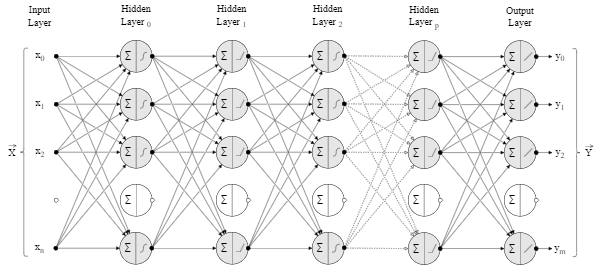
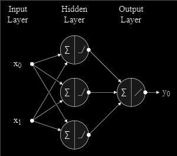
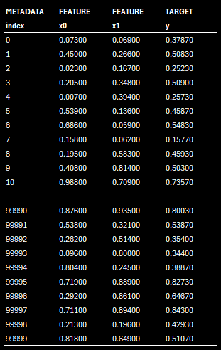
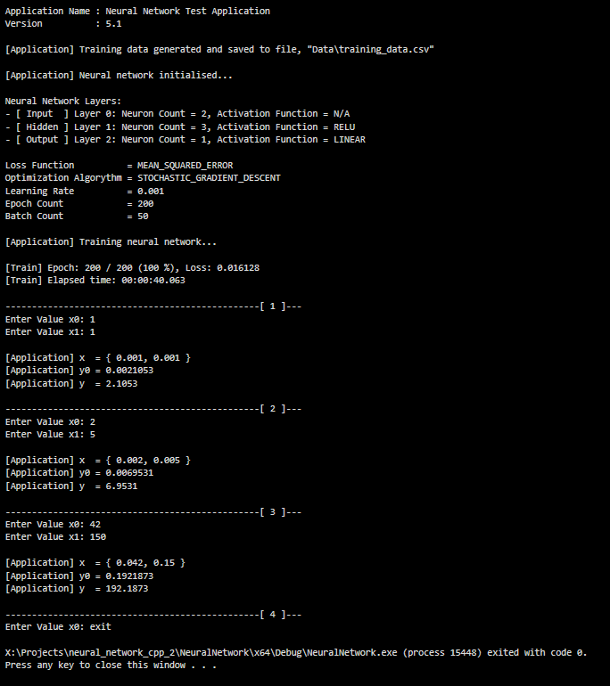

# General Purpose Multi-layer Perceptron Network Class
- General-purpose neural network class.
- Can be used for both regression and classification problems.

<p align="center">

  

</p>

<br>


## Table of Contents
1. [Installation](#installation)
2. [Overview](#overview)
3. [Example Use Case](#example-use-case)
4. [Contributing](#contributing)
5. [License](#license)
6. [Contact Information](#contact-information)
7. [Acknowledgements](#acknowledgements)
8. [To-Do](#to-do)
9. [Version History](#version-history)

## Installation:
...To do.

## Overview:
### Regression Problems :
- **Hidden Layers:**
  - The most common activation function for hidden layers in regression problems is the Rectified Linear 
    Unit ( ReLU ). 
  - ReLU allows gradients to flow back efficiently during training ( avoiding vanishing gradients ) and can 
    model non-linear relationships well.
  - Other options include Leaky ReLU, which addresses the "dying ReLU" problem, or even parametric ReLU ( PReLU ) 
    for added flexibility.
    
- **Output Layer:**
  - In regression, the output layer typically uses a linear activation function.
  - This ensures the final output represents a continuous value on the real number line, which aligns with the 
      desired outcome in regression tasks ( e.g., predicting house prices or stock values ).

### Classification Problems :
- **Hidden Layers:**
  - Similar to regression, ReLU is a popular choice for hidden layers in classification problems due to its 
    efficiency in training.
  - However, other options like tanh ( squashes values between - 1 and 1 ) or sigmoid ( outputs between 0 and 1 )
    can also be used.
  - These functions can be helpful if your data naturally falls
    within a specific range.
    
- **Output Layer:**
  - The choice for the output layer depends on the number of classes you're predicting.
  - **Binary Classification ( Two Classes ):**
    - Use the sigmoid function to transform the final output into a probability between 0 ( class 1 ) 
      and 1 ( class 2 ).
  - **Multi-Class Classification ( More Than Two Classes ):**
    - Here, you typically employ the softmax function.
    - Softmax normalizes the output layer's activations into probabilities that sum to 1, representing the
      probability of each class.      

**Note:**
- The "optimal" activation function can vary depending on your specific dataset and problem.
- Experimentation is often key. It's a good practice to start with the recommended choices above and then compare
  different options using techniques like grid search or random search to find the best-performing combination
  for your situation.

## Example Use Case

- Goal:  
  A neural network trained to add two integers.  
  $y = f ( x_0, x_1 ) \hspace{0.5cm} ...Where \hspace{2mm} f ( x_0, x_1 ) = x_0 + x_1, \hspace{4mm} x_0 \in \mathbb{Z}, \hspace{4mm} x_1 \in \mathbb{Z}$

- Initialisation Code:

    

  ```C++
  // Initialise neural network.

  vector <int>                layers                 = { 2, 3, 1 };
  vector <ActivationFunction> activation_functions   = { RELU, LINEAR };
  LossFunction                loss_function          = MEAN_SQUARED_ERROR;
  double                      learning_rate          = 0.001;
  int                         epoch_count            = 200;
  int                         batch_size             = 50;
  OptimizationAlgorithm       optimization_algorithm = STOCHASTIC_GRADIENT_DESCENT;
  
  NeuralNetwork neural_network
  (
      layers,
      activation_functions,
      loss_function,
      learning_rate,
      epoch_count,
      batch_size,
      optimization_algorithm,
      training_results_file_name
  );
  ```

- Test Data:

  
  
- Test Run:
  
  
  

## Contributing
Contributions are welcome! Please follow the contribution guidelines.
1. Fork the project.
2. Create your feature branch (git checkout -b feature/AmazingFeature).
3. Commit your changes (git commit -m 'Add some AmazingFeature').
4. Push to the branch (git push origin feature/AmazingFeature).
5. Open a pull request.

## License
Distributed under the MIT License. See LICENSE for more information.

## Contact Information
- Twitter: [@rohingosling](https://x.com/rohingosling)
- Project Link: [https://github.com/your-username/your-repo](https://github.com/rohingosling/pinger)

## To-Do:
1. Re-add support for different types of weight initialization.
 
   - Xavier/Glorot Initialization:
     This method works well with activation functions like tanh and sigmoid.
      
   - He Initialization:
     This method works well with activation functions like ReLU.
 
2. Add a log file. 

